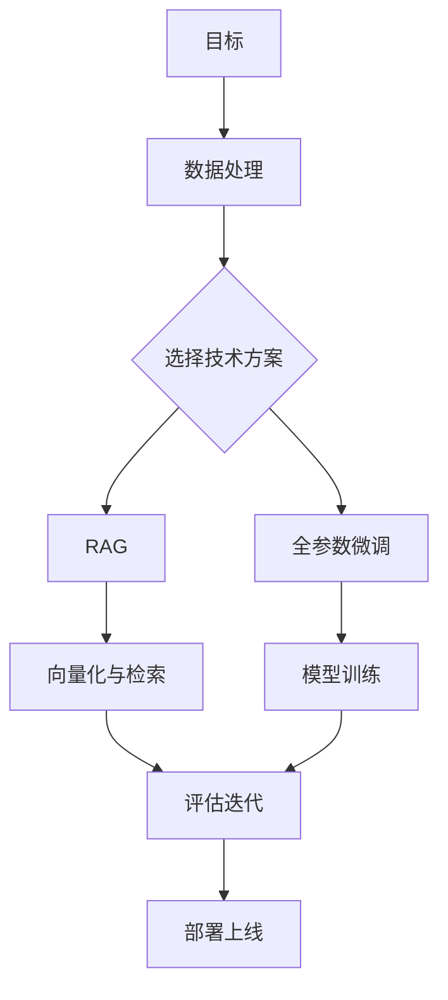

# JianLaiRAG

让AI读懂一本小说，创造一个能与读者对话的“数字生命”。

## 项目简介

本项目利用大语言模型，让AI深度“读懂”小说，将其转化为一个名为“书魂”的数字生命体。用户可与之对话，深入探讨角色、情节与主题，将阅读后的意犹未尽，转化为一场沉浸式的互动对谈，重塑文学体验。

## 功能特性

- 🔍 **智能检索**：高效的文档检索和语义搜索
- 🤖 **生成式问答**：基于检索内容生成准确答案
- 📚 **多文档支持**：支持多种文档格式和来源
- 🚀 **高性能**：优化的检索和生成流程

## 技术栈

- Python
- （待补充具体技术栈）

## 安装说明

### 环境要求

- Python 3.10+
- （待补充其他依赖）

### 安装步骤

```bash
# 克隆项目
git clone https://github.com/Discovery-Unlimited/JianLaiRAG.git
cd JianLaiRAG

# 安装依赖
pip install -r requirements.txt
```

## 使用方法

data下载地址：
```
http://60.28.24.169/d/bfd7dce337984acb99c3/
Fr5$LtS)KS
```

先用 `python -m tools.check_gpu_support.py`检查GPU支持情况
根据CUDA版本安装对应的PyTorch
如果下载速度慢，可以替换为镜像源：

```bash
如：
pip install torch torchvision --index-url https://download.pytorch.org/whl/cu130
替换为：
pip install torch torchvision --index-url https://mirrors.nju.edu.cn/pytorch/whl/cu130
```

chromadb卡编译，可以这样安装：

```bash
pip install setuptools
pip install chromadb --no-build-isolation
pip install -r requirements.txt

```

## 手动下载模型

```bash
# 1. 安装huggingface_cli
pip install "huggingface_hub[cli]"
# 2. 设置镜像环境变量(可选)
Windowns:
$env:HF_ENDPOINT="https://hf-mirror.com"
Linux:
export HF_ENDPOINT="https://hf-mirror.com"

# 3. 下载模型
hf download BAAI/bge-m3 --local-dir ./models/bge-m3

```

## 项目结构

[项目结构](Docs/RAG_Solution.md)

## 开发计划

- [ ] 知识库构建
- [ ] 问答查询
- [ ] Web 界面

## 贡献指南

欢迎提交 Issue 和 Pull Request！

## 许可证

（待补充许可证信息）

## 联系方式

（待补充联系方式）

## 方向

